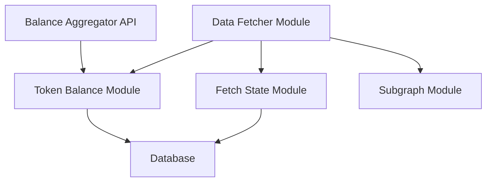

# Giveconomy Balance Aggregator

## 1. Project Overview

### Purpose

The Giveconomy Balance Aggregator is a NestJS-based service that records and tracks token balances across the Giveth ecosystem. It serves as a central component for tracking and token balances across different networks and protocols and single source of truth fot GIV token balances at a given timestamp.
This service is used to power the Giveconomy website and provide accurate and up-to-date information about the token balances of GIV token across different networks and protocols, per account addresses, at any given timestamp.

### Key Features

- Token balance tracking and aggregation
- Multi-network support
- Subgraph integration for blockchain data
- Database persistence for historical data
- Time range and block range based queries supported

### Live Links

- Production: [Coming Soon]
- Staging: [Coming Soon]

## 2. Architecture Overview

### System Diagram



### Tech Stack

- **Backend Framework**: NestJS
- **Database**: PostgreSQL
- **ORM**: TypeORM
- **API Documentation**: Swagger
- **Testing**: Jest
- **Containerization**: Docker

### Data Flow

1. Data is fetched from various sources including subgraphs and blockchain networks
2. Data is processed and normalized in the respective modules
3. Processed data is stored in the PostgreSQL database
4. API endpoints provide access to the aggregated data

## 3. Getting Started

### Prerequisites

- Node.js 18.x
- PostgreSQL 12+
- Docker
- npm or yarn

### Installation Steps

1. Clone the repository:

   ```bash
   git clone https://github.com/giveth/giveconomy-balance-aggregator.git
   cd giveconomy-balance-aggregator
   ```

2. Install dependencies:

   ```bash
   npm install
   ```

3. Set up the database:
   ```
   docker compose -f docker/docker-compose-local-postgres.yml up -d
   ```

### Configuration

#### Environment Variables

Environment variables are stored in the `config` directory and includes database credentials and blockchain configuration.

```
DATABASE_HOST=localhost
DATABASE_PORT=5532
DATABASE_USER=postgres
DATABASE_PASSWORD=postgres
DATABASE_NAME=balance-aggregator

SUBGRAPH_PAGINATION_LIMIT=5000

BLOCKCHAIN_CONFIG_FILE_NAME=test.yaml
```

`BLOCKCHAIN_CONFIG_FILE_NAME` is the name of the file in the `config/blockchain` directory that contains the blockchain configuration.

Copy the `example.env` file to config directory and rename it to `production.env` or `development.env` based on your environment. `development.env` is used by default, unless the NODE_ENV is set to `production`.

#### Blockchain Configuration

Blockchain configuration is stored in the `config/blockchain` directory and includes the network name, token (GIV) contract address, subgraph url and fetch interval.

```yaml
networks:
  - name: test-network
    network: 1
    contractAddress: '0x1111111111111111111111111111111111111111'
    subgraphUrl: 'https://api.thegraph.com/subgraphs/name/giveth/test'
    fetchInterval: 5000
  - name: test-graphql
    contractAddress: '0x31a5aea76af79f592a3a3f46a9f6cb118990433b'
    subgraphUrl: 'https://api.thegraph.com/subgraphs/name/giveth/giveth-economy-xdai-staging'
    fetchInterval: 5000
```

## 4. Usage Instructions

### Running the Application

- Development mode:
  ```bash
  npm run start:dev
  ```
- Production mode:
  ```bash
  npm run build
  npm run start:prod
  ```

### Common Tasks

- Code formatting:
  ```bash
  npm run format
  ```
- Linting:
  ```bash
  npm run lint
  ```

## 5. Deployment Process

### Environments

- Development
- Production

### Deployment Steps

1. Build the Docker image:

   ```bash
   docker build -t giveconomy-balance-aggregator .
   ```

2. Run the container:
   ```bash
   docker run -p 3000:3000 giveconomy-balance-aggregator
   ```

### CI/CD Integration

The project uses GitHub Actions for CI/CD. Workflows are defined in the `.github/workflows` directory.

## 6. Troubleshooting

### Common Issues

1. **Database Connection Issues**

   - Verify database credentials in env file in config directory
   - Check if PostgreSQL is running
   - Ensure database exists and is accessible

2. **Build Failures**

   - Clear node_modules and reinstall dependencies
   - Check TypeScript compilation errors
   - Verify all environment variables are set

3. **Balances are not updated**
   - Check if the blockchain configuration is correct
   - Check if the subgraph is up and doesn't lag behind
   - Check if the fetch interval is correct
   - Check if the data is being fetched correctly

### Logs and Debugging

- Development logs are available in the console
- Production logs can be accessed through Docker:
  ```bash
  docker logs <container_id>
  ```
- Enable debug mode:
  ```bash
  npm run start:debug
  ```
